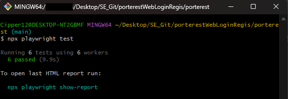
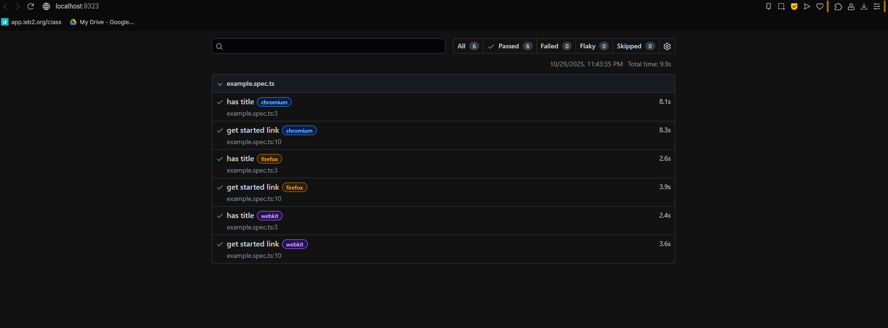

# E2E Setup Log

This project uses [Playwright](https://playwright.dev/) as the primary toolkit for E2E testings. The reasons why we have chosen it are as follows: 

- Playwright is made for web app development testing. It is appropriate for this project.
- As it is an open-source project, it’s free.
- Unlimited usage. No monthly limit on how many tests you can do.
- Cross compatibility with different browsers, platforms and coding languages.

Below is a guide that provides instructions on setting up the E2E testing environment.

## Getting Started

- Run all commands from within the `porterest` directory.

1.  **Install Playwright:** You can also follow the official instructions at [playwright.dev](https://playwright.dev/)

```bash
npm init playwright@latest
```

2.  **Update Playwright:**

```bash
npm install -D @playwright/test@latest
npx playwright install --with-deps
```

3.  **Check your installed version:**

```bash
npx playwright --version 
```

## Running the Example Test

After Playwright has been installed with the latest update you can verify it by running the included example test. You can use default mode to display output and the result in the terminal or use the UI mode to do the same with live step view, time travel debugging and more.

### Default Mode

To run the example test:

```bash
npx playwright test
```



To check the test report:

```bash
npx playwright show-report
```



### UI Mode

To run the example test in UI mode:

```bash
npx playwright test --ui
```

